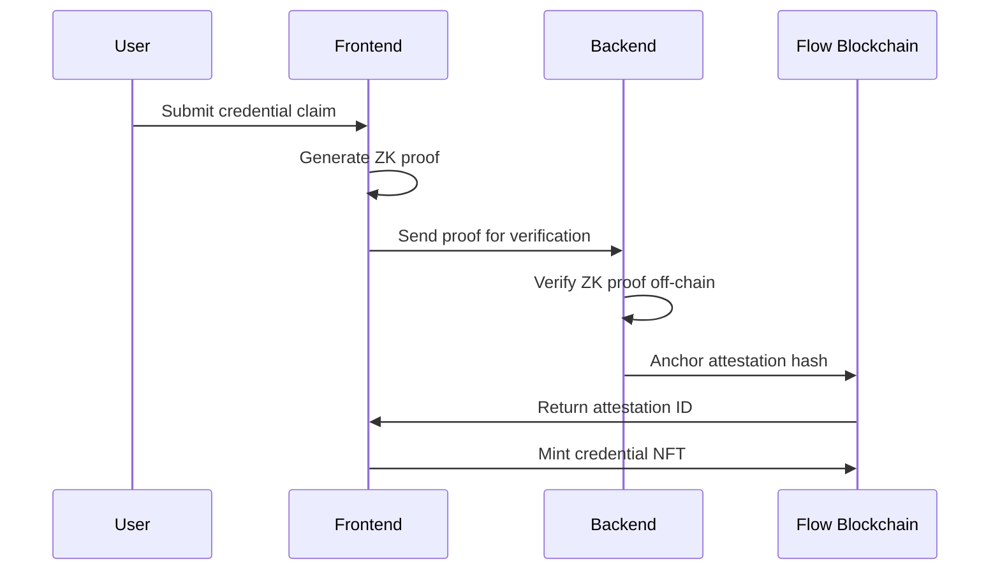

# Delego - NFT-Based Subscription Sharing Platform


Delego is a revolutionary decentralized platform built on Flow blockchain that enables secure sharing and renting of digital subscriptions using NFTs and Zero-Knowledge proofs. The platform provides privacy-first identity verification and time-bound delegation for subscription access.

## 🌟 Key Features

### 🔐 Privacy-First Identity Verification
- **Zero-Knowledge Proofs**: Verify user credentials without revealing personal information
- **Off-chain ZK Proof Storage**: Proofs generated and verified off-chain, with only attestation anchors stored on Flow blockchain
- **Self-Attestation Registry**: On-chain registry for anchoring ZK proof attestations

### 💎 NFT-Based Subscription System
- **Subscription NFTs**: Each subscription is represented as a unique NFT with metadata
- **Time-Bound Access**: NFTs contain expiration timestamps for rental periods
- **Delegation Mechanism**: Secure delegation of subscription access using NFT transfers

### ⚡ Auto-Connect Wallet Feature
- **Seamless Demo Mode**: Automatic fallback to demo mode for instant platform exploration
- **Mock Flow Integration**: Shows authentic Flow wallet connection dialog before demo mode
- **Demo Address**: `0x1635dff04f103087` - Seamlessly integrated without obvious demo labels
- **Full Functionality**: All features work in demo mode including transactions (mocked)

## 🏗️ Architecture Overview

```
┌─────────────────────────────────────────────────────────────┐
│                    Flow Blockchain Layer                     │
├─────────────────────────────────────────────────────────────┤
│  Smart Contracts:                                           │
│  ├── SelfAttestationRegistry.cdc (ZK Attestation Anchors)   │
│  ├── SubscriptionNFT.cdc (Subscription Tokens)             │
│  ├── DelegationNFT.cdc (Access Delegation)                 │
│  └── NetflixNFT.cdc (Netflix-specific Implementation)      │
└─────────────────────────────────────────────────────────────┘
┌─────────────────────────────────────────────────────────────┐
│                     Application Layer                       │
├─────────────────────────────────────────────────────────────┤
│  Frontend (React + TypeScript):                            │
│  ├── Wallet Integration (FCL)                              │
│  ├── ZK Proof Generation                                   │
│  ├── NFT Marketplace                                       │
│  └── Subscription Management                               │
└─────────────────────────────────────────────────────────────┘
┌─────────────────────────────────────────────────────────────┐
│                      Off-Chain Layer                       │
├─────────────────────────────────────────────────────────────┤
│  Backend Services:                                         │
│  ├── ZK Proof Verification                                 │
│  ├── Credential Validation                                 │
│  ├── Subscription Service Integration                      │
│  └── Event Processing & Logging                           │
└─────────────────────────────────────────────────────────────┘
```

## 🔗 ZK Proof Integration & On-Chain Credentials

### Why Off-Chain ZK Verification?

Flow blockchain currently doesn't support native on-chain ZK proof verification. Our solution:

1. **ZK Proof Generation**: Generated client-side using cryptographic libraries
2. **Off-Chain Verification**: Backend services verify proofs using established ZK libraries
3. **On-Chain Attestation**: Only proof hashes and signatures are stored on-chain
4. **Credential Anchoring**: NFTs store references to verified credentials

### ZK Proof Workflow



### Credential Types Supported

- **Human Verification**: Prove you are a real person without revealing identity
- **Age Verification**: Prove age requirements without revealing exact age/DOB
- **Subscription Ownership**: Prove valid subscription without revealing account details
- **Geographic Location**: Prove location requirements for regional content access

## 🚀 Quick Start

### Prerequisites

- Node.js 18+ and npm
- Flow CLI installed
- Flow wallet (Lilico, Blocto, or other FCL-compatible wallet)

### Installation

```bash
# Clone the repository
git clone https://github.com/itsharshpro/delego.git
cd delego

# Install all dependencies
npm run install:all

# Start development environment
npm run dev
```

This will start:
- Frontend: `http://localhost:5173`
- Backend: `http://localhost:3001`

### Smart Contract Deployment

```bash
# Deploy contracts to Flow Testnet
npm run deploy:contracts

# Run contract tests
npm run test:contracts
```

## 📁 Project Structure

```
delego/
├── frontend/                 # React + TypeScript frontend
│   ├── src/
│   │   ├── components/      # React components
│   │   │   ├── WalletConnect.tsx     # Auto-connect wallet component
│   │   │   ├── ZKProofGenerator.tsx  # ZK proof generation
│   │   │   ├── Marketplace.tsx       # NFT marketplace
│   │   │   └── ...
│   │   ├── contexts/        # React contexts
│   │   │   ├── WalletContext.tsx     # Wallet state management
│   │   │   └── FlowContext.tsx       # Flow blockchain integration
│   │   ├── services/        # External service integrations
│   │   └── types/           # TypeScript type definitions
├── backend/                  # Node.js backend services
│   ├── routes/              # API endpoints
│   │   ├── zk.js           # ZK proof verification endpoints
│   │   ├── flow.js         # Flow blockchain interactions
│   │   └── ...
│   └── logs/               # Application logs
├── cadence/                 # Flow smart contracts
│   ├── contracts/          # Contract source code
│   │   ├── SelfAttestationRegistry.cdc
│   │   ├── SubscriptionNFT.cdc
│   │   ├── DelegationNFT.cdc
│   │   └── NetflixNFT.cdc
│   ├── transactions/       # Flow transactions
│   ├── scripts/           # Flow scripts
│   └── tests/             # Contract tests
└── package.json           # Root package configuration
```

## 💻 Usage Guide

### 1. Wallet Connection

The platform features intelligent wallet connection with seamless demo mode:

- Click "Connect Wallet" to see authentic Flow wallet selection dialog
- Demo mode activates automatically after 2 seconds for instant access
- Demo mode uses address `0x1635dff04f103087` without obvious labeling
- All platform features work seamlessly in demo mode with mocked transactions
- Perfect for demonstrations and quick platform exploration

### 2. Identity Verification

```typescript
// Generate ZK proof for human verification
const proof = await generateZKProof({
  type: 'human',
  credentials: userCredentials
});

// Verify proof off-chain
const isValid = await verifyProof(proof);

// Anchor attestation on-chain
if (isValid) {
  await anchorAttestation(proof.hash, proof.signature);
}
```

### 3. Subscription Sharing

1. **Create Subscription NFT**: Mint an NFT representing your subscription
2. **Set Rental Terms**: Define price, duration, and access conditions
3. **List on Marketplace**: Make available for other users to rent
4. **Automatic Delegation**: NFT transfer grants time-bound access

### 4. Renting Subscriptions

1. **Browse Marketplace**: View available subscription rentals
2. **Verify Credentials**: Use ZK proofs to meet access requirements
3. **Rent Subscription**: Purchase time-bound access via NFT
4. **Access Service**: Use delegated credentials for the rental period

## 🔧 API Reference

### ZK Proof Endpoints

```javascript
// Generate ZK proof
POST /api/zk/generate
{
  "type": "human|age18|subscription",
  "credentials": {...},
  "userAddress": "0x..."
}

// Verify ZK proof
POST /api/zk/verify
{
  "proof": {...},
  "publicSignals": [...],
  "proofType": "human"
}
```

### Flow Integration

```javascript
// Mint subscription NFT
POST /api/flow/mint-subscription
{
  "service": "netflix|spotify|disney",
  "duration": 2592000, // seconds
  "price": "10.0", // FLOW tokens
  "metadata": {...}
}

// Create delegation
POST /api/flow/create-delegation
{
  "subscriptionId": 123,
  "delegate": "0x...",
  "expiryTime": 1640995200
}
```

## 🛡️ Security & Privacy

### Zero-Knowledge Proofs
- **No Personal Data**: Proofs verify claims without revealing underlying data
- **Cryptographic Security**: Built on proven ZK-SNARK/STARK protocols
- **Verifiable**: Anyone can verify proof validity without access to private inputs

### Smart Contract Security
- **Cadence Language**: Resource-oriented programming prevents common vulnerabilities
- **Access Control**: Role-based permissions for sensitive operations
- **Time-bound Access**: Automatic expiration of delegated permissions

### Off-Chain Storage
- **Encrypted Credentials**: User credentials encrypted before off-chain storage
- **Minimal On-Chain Data**: Only hashes and public attestations stored on blockchain
- **GDPR Compliant**: Users control their data with right to deletion

## 🧪 Testing

```bash
# Run frontend tests
cd frontend && npm test

# Run backend tests
cd backend && npm test

# Run Flow contract tests
flow test

# Integration tests
npm run test:integration
```

## 🚀 Deployment

### Frontend Deployment (Vercel)

```bash
cd frontend
npm run build
# Deploy to Vercel, Netlify, or other static hosting
```

### Backend Deployment (Railway/Render)

```bash
cd backend
# Set environment variables
export FLOW_ACCESS_NODE_URL=https://rest-testnet.onflow.org
export MONGODB_URI=mongodb://...
npm start
```

### Smart Contract Deployment

```bash
# Deploy to Flow Testnet
flow project deploy --network=testnet

# Deploy to Flow Mainnet
flow project deploy --network=mainnet
```

## 🤝 Contributing

1. Fork the repository
2. Create a feature branch (`git checkout -b feature/amazing-feature`)
3. Commit your changes (`git commit -m 'Add amazing feature'`)
4. Push to the branch (`git push origin feature/amazing-feature`)
5. Open a Pull Request

### Development Setup

```bash
# Install development dependencies
npm install

# Set up pre-commit hooks
npx husky install

# Run linting
npm run lint

# Format code
npm run format
```

## 📋 Roadmap

- [ ] **Q4 2024**
  - ✅ Core NFT subscription system
  - ✅ ZK proof integration
  - ✅ Auto-connect wallet feature
  - [ ] Netflix integration
  - [ ] Spotify integration

- [ ] **Q1 2025**
  - [ ] Mobile app (React Native)
  - [ ] Advanced ZK circuits
  - [ ] Cross-platform subscriptions
  - [ ] DAO governance

- [ ] **Q2 2025**
  - [ ] Layer 2 scaling
  - [ ] Enterprise partnerships
  - [ ] Advanced analytics
  - [ ] Global expansion

## 📄 License

This project is licensed under the MIT License - see the [LICENSE](LICENSE) file for details.

## 🙏 Acknowledgments

- **Flow Blockchain**: For providing a developer-friendly blockchain platform
- **FCL (Flow Client Library)**: For seamless wallet integration
- **ZK Community**: For advancing zero-knowledge proof research
- **Open Source Contributors**: For building the tools that make this possible

---

**Built with ❤️ on Flow Blockchain**

For questions or support, please open an issue or contact us at support@delego.app
